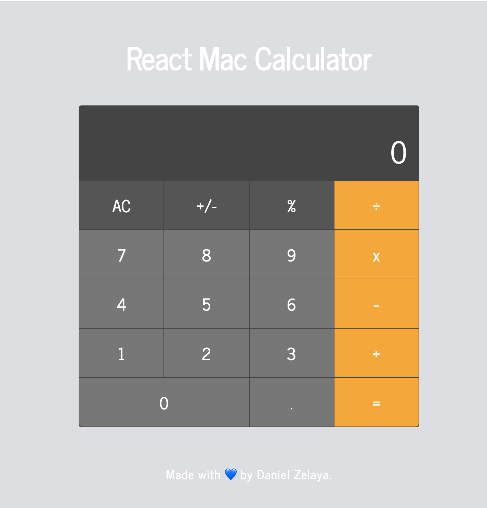

# Mac Calculator

It's been a long time since my last React **side** project. This is a MacOS Calculator App clone (sorta) made with React.js ⚛️ and Styled Components 💅🏻. It supports the basic arithmetic operations as well as the % operator, which behaves like the one on the MacOs app.
Now of course, it's not an _exact 100%_ clone, but it's close enough. I allowed myself to diverge every now and then with some behaviors that I dislike of the MacOS Calculator.
At any rate, I'm very happy with the result. **Do let me know if you find any bugs.**

## Controls

- The controls are clickable of course
- You can use the keyboard to input Numbers, Decimal Point, Backspace, Operators
- Typing Enter will compute the operation
- C will clear the operation

## Screenshots

